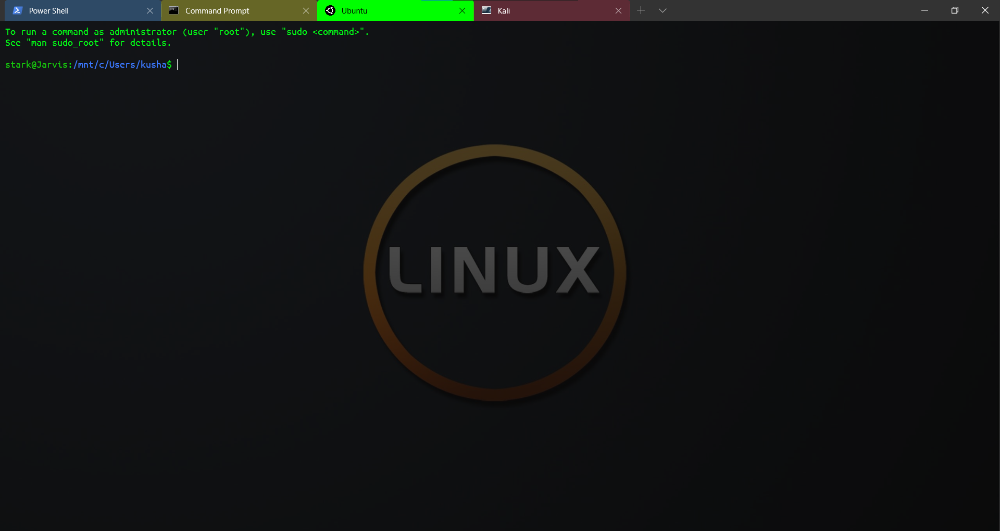

<h3>Checkout out windows terminal : https://github.com/microsoft/terminal </h3>
<h1> My Windows Terminal Appearance customizations</h1>

<i>Place the files from resources at : C:/Users/{USERNAME}/AppData/Local/Packages/Microsoft.WindowsTerminal_8wekyb3d8bbwe/RoamingState</i>

<h5> Download ubuntu mono or other fonts from : https://fonts.google.com/ </h5>

